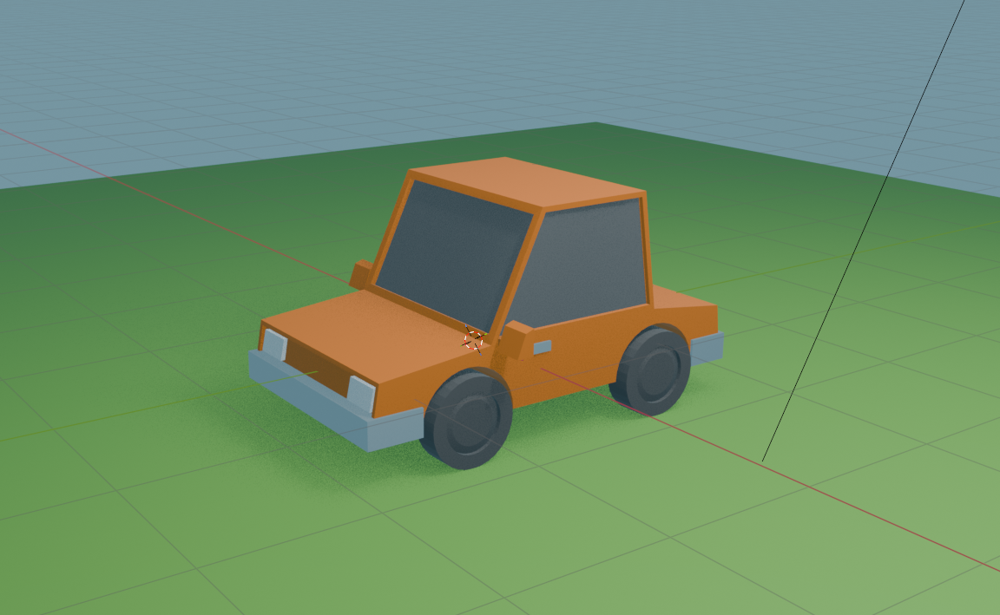

# Blender Car Tutorial

A Blender project for creating a car model as part of a tutorial.

## Project Files

- **Car.blend** - The main Blender project file containing the car model

## Work in Progress

Here's the current progress on the car model:

## Getting Started

1. Install [Blender](https://www.blender.org/)
2. Open `Car.blend` in Blender
3. Start modeling and texturing

## License

[Add your license information here]
